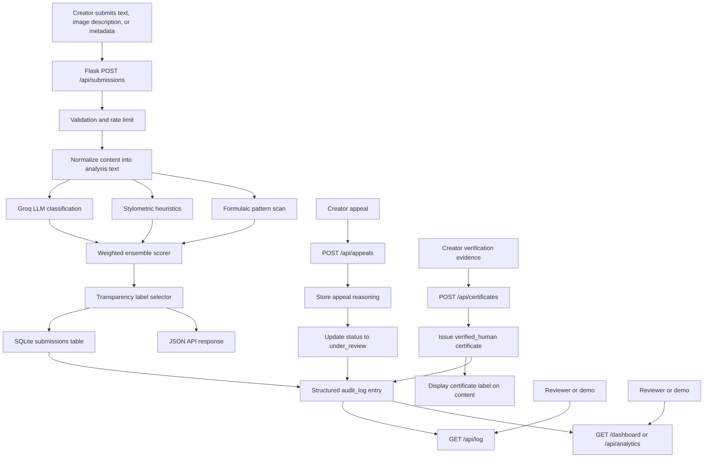

# Provenance Guard Planning

## Milestone 1 Checklist

- Required features read and translated into one end-to-end system path.
- Detection signals chosen before implementation: Groq LLM classification, stylometric heuristics, and a formulaic pattern scan.
- Confidence score ranges and uncertainty thresholds defined before coding.
- Transparency label text drafted for high-confidence AI, uncertain, and high-confidence human results.
- Appeals workflow planned, including creator reasoning, status update, and audit-log behavior.
- Edge cases identified before implementation.
- Architecture diagram included under `## Architecture`.
- AI Tool Plan included with the specific implementation work delegated to AI assistance and how it will be checked.

## Milestone 2 Checklist

- `planning.md` exists in the repo root and is the primary implementation spec.
- Detection signals are defined with what each measures, the output shape, blind spots, and combination strategy.
- Uncertainty representation defines what middle scores mean and the thresholds for likely AI, uncertain, and likely human labels.
- Transparency label design includes the exact text for all three required variants.
- Appeals workflow defines who can appeal, what information they provide, what status changes, what gets logged, and what a reviewer sees.
- Anticipated edge cases name specific content types and failure modes.
- `## Architecture` includes the diagram and narrative for submission and appeal flows.
- `## AI Tool Plan` specifies M3, M4, and M5 inputs, generation requests, and verification checks.

## Problem Summary

Creative sharing platforms need a way to give readers context about whether a post appears human-written, AI-generated, or uncertain without turning an imperfect detector into a final judgment. Provenance Guard accepts submitted writing, runs multiple independent review signals, combines those signals into a confidence-aware result, returns a plain-language transparency label, and gives creators a path to appeal.

The core design principle is caution. A false positive that labels a human creator's work as AI-generated can damage trust and discourage the creator from posting again. Because of that, the system should only use a high-confidence AI label when multiple signals point in the same direction. Borderline results should be labeled as uncertain and paired with an appeal path.

## Architecture



## Architecture Narrative

A single piece of content starts as a creator submission to the platform. The API receives direct text, an image description, or structured metadata, normalizes it into analysis text, validates that it has enough content to evaluate, and checks the rate limit before spending model or storage resources. Then the normalized text is sent through independent detection components. The Groq LLM signal gives a semantic review, the stylometric signal measures statistical writing structure, and the formulaic pattern signal looks for template-like repetition.

Those signal results move into the ensemble scorer, which combines them into an `ai_probability` and `confidence_score`. The label selector turns those numbers into the reader-facing output: likely AI, likely human, or uncertain. The API stores the result in SQLite with a content hash, content preview, timestamp, signal details, confidence, and final label text. At the same time, it writes a structured audit-log event so reviewers can inspect what happened later. Finally, the API returns a JSON response that includes the attribution result, confidence score, transparency label, and individual signal scores.

If a creator disagrees with the decision, they submit an appeal against the `submission_id`. The appeals endpoint records the creator's reasoning, changes the content status to `under_review`, and writes an appeal event to the same audit log so the appeal is visible beside the original classification. If a creator completes an additional verification step, the certificate endpoint records the verification evidence, marks the content `verified_human`, and returns a display label that can be shown with the content. Reviewers can also open the analytics dashboard to see detection patterns, appeal rate, and average confidence.

## Component Responsibilities

| Component | Responsibility |
| --- | --- |
| Flask API | Owns request validation, HTTP responses, and route boundaries. |
| Flask-Limiter | Protects the content submission endpoint from floods and repeated probing. |
| Content normalizer | Converts text, image descriptions, and structured metadata into analysis text while preserving content type and source payload. |
| Detection pipeline | Runs independent signals and returns normalized `0.0` to `1.0` scores. |
| Ensemble scorer | Combines signal scores, calculates confidence, and keeps uncertain cases uncertain. |
| Label selector | Maps scores to exact reader-facing label text. |
| Certificate workflow | Stores verified-human credentials earned through additional creator evidence and exposes the display label on content records. |
| Analytics dashboard | Summarizes detection patterns, appeal rate, average confidence, and certificate metrics. |
| SQLite audit store | Persists submissions, appeals, certificates, and structured audit-log events. |
| `GET /api/log` | Makes grader/reviewer evidence visible in structured JSON. |

## API Surface

| Endpoint | Input | Output | Purpose |
| --- | --- | --- | --- |
| `GET /health` | No body | `{ "status": "ok" }` | Quick local/demo health check. |
| `POST /api/submissions` | `content` string, optional `creator_id` string | Submission id, attribution result, `ai_probability`, `confidence_score`, transparency label text, signal details, status, timestamp | Classify a new text submission. |
| `POST /api/submissions` | `content_type: image_description` plus `image_description` | Same classification output plus `content_type` and source payload | Classify an image-derived description through the provenance pipeline. |
| `POST /api/submissions` | `content_type: metadata` plus `metadata` object | Same classification output plus `content_type` and source payload | Classify structured metadata through the provenance pipeline. |
| `GET /api/submissions/<submission_id>` | Submission id in URL | Stored classification record and current status | Let a reviewer or demo inspect one submission after classification or appeal. |
| `POST /api/appeals` | `submission_id`, `reason`, optional `creator_id` | Appeal id, original decision summary, updated status, timestamp | Let creators contest a classification. |
| `POST /api/certificates` | `submission_id`, `creator_id`, `verification_method`, `evidence_summary` | Verified-human certificate and display label | Let creators earn a provenance certificate through an additional verification step. |
| `GET /api/analytics` | No body | Detection patterns, appeal rate, average confidence, certificate metrics | Provide dashboard data for reviewers and demos. |
| `GET /dashboard` | No body | Simple HTML analytics dashboard | Show detection patterns, appeal rate, and one additional metric visually. |
| `GET /api/log?limit=10` | Optional `limit` query parameter | Structured audit-log entries | Show classification and appeal evidence for grading/review. |

## Submission Flow

1. A creator sends text, an image description, or structured metadata plus an optional `creator_id` to `POST /api/submissions`.
2. Flask normalizes the content into analysis text, validates that it is long enough to score, and Flask-Limiter checks the per-IP limit.
3. The detection pipeline runs three signals:
   - Groq LLM classification for semantic judgment.
   - Stylometric heuristics for measurable writing structure.
   - Formulaic pattern scan for repeated template-like phrasing.
4. The ensemble scorer computes a weighted `ai_probability`, signal agreement, and final `confidence_score`.
5. The label selector maps the score into one of three reader-facing label variants.
6. SQLite stores the decision with a content hash, content preview, status, scores, signal details, and timestamps.
7. A structured `classification_decision` audit entry is written.
8. The API returns JSON with the attribution result, confidence score, transparency label, and per-signal details.

## Appeal Flow

1. A creator sends `submission_id`, `creator_id`, and `reason` to `POST /api/appeals`.
2. The app verifies that the original submission exists.
3. The appeal is stored with the creator's reasoning.
4. The submission status changes from `classified` to `under_review`.
5. A structured `appeal_submitted` audit entry records the appeal and original decision.
6. A human reviewer can inspect the appeal through `GET /api/log` or `GET /api/submissions/<submission_id>` and see the original result, confidence score, label text, signal evidence, and creator reasoning.

## Detection Signals

| Signal | Property measured | Output shape | Why it helps | Limitation |
| --- | --- | --- | --- | --- |
| Groq LLM classification | Semantic and stylistic plausibility judged by `llama-3.3-70b-versatile`. | JSON-like signal object with `ai_probability` from `0.0` to `1.0`, `confidence` from `0.0` to `1.0`, availability flag, and a short rationale. | It can detect holistic patterns that simple statistics miss. | It can be overconfident, can inherit model bias, and depends on API availability. |
| Stylometric heuristics | Sentence-length variance, vocabulary diversity, average sentence length, punctuation density. | Signal object with `ai_probability`, `confidence`, and details such as type-token ratio, sentence count, average sentence length, and punctuation density. | AI-generated prose often has smoother structure and less irregularity than human drafts. | Genre and author style can produce similar statistics. It cannot understand meaning or drafting history. |
| Formulaic pattern scan | Template phrases, repeated bigrams, repeated sentence openings. | Signal object with `ai_probability`, `confidence`, and details such as formulaic marker hits, repeated bigram ratio, and repeated sentence openers. | Generated text can lean on repeated transitions or generic framing. | Formal human essays can trigger the same markers, and subtle AI text may avoid obvious repeated phrases. |

### Why These Signals Are Distinct

The Groq signal is semantic: it asks a model to judge the whole text as writing. Stylometric heuristics are structural: they measure the distribution and variability of the text without interpreting its meaning. The formulaic pattern scan is phrase-pattern based: it looks for repeated or generic wording that can appear in generated prose. These are distinct because they inspect different properties of the submission rather than running three versions of the same classifier.

The minimum required pair is Groq plus stylometry. I added the formulaic scan as a third small signal because repeated template phrasing is not the same as general sentence-length variance or vocabulary diversity. It also gives local development a useful extra signal if Groq is unavailable.

### Combined Decision Output

Every signal is normalized to the same interface:

```json
{
  "name": "stylometric_heuristics",
  "ai_probability": 0.64,
  "confidence": 0.72,
  "available": true,
  "rationale": "Measures structural regularity.",
  "details": {}
}
```

The final API response combines those signals into:

- `attribution_result`: `ai_generated`, `human_written`, or `uncertain`.
- `ai_probability`: weighted probability-like score from `0.0` to `1.0`.
- `confidence_score`: strength of evidence for showing a clear label.
- `transparency_label`: exact reader-facing label text.
- `signals`: list of individual signal outputs so the result is auditable.

## Uncertainty Representation

When Groq is available, weights are:

- Groq LLM classification: 55%
- Stylometric heuristics: 30%
- Formulaic pattern scan: 15%

When Groq is unavailable, the available local signals are reweighted so the app still returns a useful development result. The final demo should use Groq so the recommended signal is active.

Thresholds:

| Range | Label |
| --- | --- |
| `ai_probability >= 0.72` and `confidence_score >= 0.70` | High-confidence AI |
| `ai_probability <= 0.28` and `confidence_score >= 0.70` | High-confidence human |
| Everything else | Uncertain |

`0.50` means the system does not have a strong direction. A confidence score around `0.60` means the system has a mild lean but not enough evidence to show a strong claim to readers, so the label should usually be uncertain unless the probability is far from the middle and signals agree. Scores near `0.51` should produce the uncertain label because the evidence is too weak to be useful to readers. Scores near `0.95` should produce a high-confidence label only when signals strongly agree.

### Score Calibration Plan

Uncertainty is a first-class result, not an error state. If the system lands near the middle or the signals disagree, the reader should see the uncertain label instead of a forced AI/human verdict. This is especially important because creative writing can be intentionally polished, repetitive, minimal, or experimental.

The confidence score should communicate strength of evidence, not moral certainty. A high confidence score means the available signals agree strongly enough to show a clearer label. A low or medium confidence score means the system should avoid overclaiming and invite more context through the appeal process.

Raw signal outputs map to the final score in two steps:

1. Compute a weighted `ai_probability` from the available normalized signal outputs.
2. Compute confidence from distance away from `0.50`, then adjust slightly upward when signals agree and keep it lower when signals conflict.

This means a text can have an `ai_probability` above `0.50` and still receive the uncertain label if the evidence is weak or mixed. That is intentional.

## Transparency Label Design

| Variant | Exact text |
| --- | --- |
| High-confidence AI | "Provenance Guard: This piece appears likely to be AI-generated. Multiple review signals point in that direction with high confidence. The creator can appeal this label." |
| High-confidence human | "Provenance Guard: This piece appears likely to be human-written. The review found limited AI-generation signals, but this is not a guarantee." |
| Uncertain | "Provenance Guard: We cannot confidently determine how this piece was created. Readers should treat the attribution as uncertain, and the creator can provide more context." |

### Label Design Notes

The labels avoid technical terms like classifier, logits, ensemble, or probability. They say what the reader needs to know, include appropriate caution, and make the appeal path visible when the result could harm the creator. The high-confidence human label still avoids saying "verified human" because this system does not prove authorship; it only reports limited AI-generation signals.

Before implementation, I reviewed the variants for three qualities:

- The likely AI label does not say "caught" or "proven" because that overstates the detector.
- The uncertain label tells readers how to interpret the result rather than treating uncertainty as a broken state.
- The likely human label avoids creating a fake certificate; verified-human status would need a separate stretch feature.

## Appeals Workflow

Any creator with a `submission_id` can appeal a classification. The appeal input is:

```json
{
  "submission_id": "uuid",
  "creator_id": "creator-optional",
  "reason": "This was drafted from my own outline and I can provide earlier versions."
}
```

When an appeal is received, the system:

1. Verifies the submission exists.
2. Requires a meaningful reason instead of an empty or one-word appeal.
3. Stores the appeal reason in the `appeals` table.
4. Updates the submission status to `under_review`.
5. Writes an `appeal_submitted` event to the audit log.
6. Returns a JSON response containing the appeal id, updated status, original decision summary, and timestamp.

A human reviewer opening the appeal queue should see:

- submission id and content preview
- original attribution result
- original confidence score and AI probability
- transparency label originally shown to readers
- per-signal scores and rationales
- creator appeal reason
- current status: `under_review`

## Rate Limit Plan

Limit: `12 per minute; 100 per day` per remote address.

This supports a creator testing multiple drafts in a short session while making it expensive for an adversary to flood the endpoint or probe the detector repeatedly. A production version would likely add account-level limits in addition to IP limits.

## Audit Log Plan

SQLite tables:

- `submissions`: one row per classified content submission.
- `appeals`: one row per creator appeal.
- `audit_log`: structured event stream containing both classification and appeal events.

Every classification entry includes:

- submission id
- timestamp
- content hash and preview
- attribution result
- AI probability
- confidence score
- label text
- signal names, scores, confidence values, rationales, and details

Every appeal entry includes:

- appeal id
- submission id
- timestamp
- creator id
- creator reasoning
- updated status
- original decision summary

## Validation Plan

To verify that scores are meaningful, I will test at least three types of input:

1. A polished, generic, formulaic sample that should push the system toward a higher AI probability.
2. A specific, sensory, uneven personal narrative sample that should push the system toward a lower AI probability.
3. A mixed or ambiguous creative sample that should produce an uncertain result.

The expected behavior is not perfect detection. The expected behavior is separation between high-confidence and lower-confidence cases, visible signal-level evidence, and conservative labeling for borderline examples.

## Anticipated Edge Cases

| Edge case | Handling |
| --- | --- |
| Very short text | Reject with `400 content_too_short` because the signals need enough evidence. |
| Groq key missing or API unavailable | Mark the Groq signal unavailable and continue with local signals for development. |
| Polished human essay | Conservative thresholds should keep borderline cases in `uncertain` instead of labeling as AI. |
| Repetitive experimental poem | May look formulaic; creator can appeal and provide drafting context. |
| Unknown submission id for appeal | Return `404 submission_not_found`. |
| Creator appeals with vague reasoning | Return a validation error and ask for a more specific explanation. |
| Same content submitted repeatedly | Store each decision separately with a content hash so reviewers can compare repeated decisions. |
| Signals strongly disagree | Route to the uncertain label because disagreement means the system should not overclaim. |
| Very polished non-native English writing | Might look formulaic because of repeated transition phrases; keep thresholds conservative and show appeal path. |
| AI text intentionally edited by a human | May produce mixed signals; return uncertain when signal disagreement is high. |

## AI Tool Plan

The AI tool plan is milestone-specific so each implementation prompt can be grounded in the spec instead of a vague feature request.

| Implementation milestone | Spec sections to provide | What I will ask AI to generate | Verification before accepting |
| --- | --- | --- | --- |
| M3: submission endpoint + first signal | `## Architecture`, `## API Surface`, `## Submission Flow`, Groq row from `## Detection Signals`, and `## Combined Decision Output` | Flask app skeleton, `POST /api/submissions` route, Groq signal function, JSON response shape, and a small health route | Run direct function checks with a few inputs, verify the route returns structured JSON, confirm missing/short content gives useful errors, and make sure the Groq result is visible as a signal object. |
| M4: second signal + confidence scoring | `## Detection Signals`, `## Uncertainty Representation`, `## Validation Plan`, and the architecture diagram | Stylometric signal function, formulaic pattern signal if time allows, ensemble scoring logic, threshold mapping, and tests for high-confidence/lower-confidence spread | Compare clearly formulaic, sensory human-like, and ambiguous samples; confirm scores vary meaningfully; confirm borderline cases stay uncertain; run unit tests. |
| M5: production layer | `## Transparency Label Design`, `## Appeals Workflow`, `## Rate Limit Plan`, `## Audit Log Plan`, and the architecture diagram | Label selector, `/api/appeals`, `/api/log`, SQLite persistence, rate limiting, and README evidence sections | Test all three label variants are reachable, submit an appeal and confirm status becomes `under_review`, confirm `GET /api/log` shows at least three structured entries including an appeal, and verify rate limiting returns HTTP `429`. |

I will verify generated code by running the unit tests, running the demo seed script, checking real API responses, and confirming that README evidence covers the rubric items. I will also manually review the labels to make sure they sound fair to a non-technical reader and do not imply certainty the system does not have.

## Stretch Feature Gate

Before starting any stretch feature, I will update this planning document with:

- which stretch feature is being attempted
- how it changes the architecture diagram
- what new data is stored or returned
- how it will be documented in the README
- how it will be verified in a demo or test

## Stretch Feature: Ensemble Detection

Stretch feature attempted: ensemble detection. The required system needs at least two distinct signals; this project implements three by adding `formulaic_pattern_scan` alongside Groq LLM classification and stylometric heuristics.

Architecture impact: the architecture diagram already includes the third signal as `Formulaic pattern scan`, feeding the same weighted ensemble scorer as the other signals. No separate service is needed because the formulaic scan is a local Python signal.

Data returned and stored: each submission response and `classification_decision` audit-log event includes all three signal objects in the `signals` array. Each object includes `name`, `ai_probability`, `confidence`, `available`, `rationale`, and signal-specific `details`.

README documentation: the ensemble is documented in `## Detection Signals`, `## Confidence and Uncertainty`, and the Milestone 4 through Milestone 6 evidence sections. The README explains why the third signal is distinct, how it is weighted, and what it can misclassify.

Verification: `python scripts/milestone4_eval.py` shows the third signal's score beside the other signals, `python scripts/milestone5_demo.py` proves the production flow still returns all label variants, and `python -m unittest discover -s tests` verifies the API and audit log include per-signal evidence.

## Stretch Feature: Provenance Certificate

Stretch feature attempted: provenance certificate. A creator can earn a `verified_human` credential for a specific submission by completing an additional verification step with a method such as draft-history review, platform identity review, or manual review.

Architecture impact: the certificate flow starts after a submission exists. A creator sends `submission_id` or `content_id`, `creator_id`, `verification_method`, and `evidence_summary` to a certificate endpoint. The app stores the certificate, updates the content status to `verified_human`, and writes a `certificate_issued` audit event beside the original classification.

Data returned and stored: the certificate stores a certificate id, content id, creator id, method, evidence summary, status, display label, and timestamp. `GET /api/submissions/<id>` returns a `provenance_certificate` object so the verified-human credential can be displayed with the content.

README documentation: the README will document the endpoint, display label, and example response in the stretch features section.

Verification: tests will create a submission, issue a certificate, confirm the submission status becomes `verified_human`, confirm the certificate display label is returned with the content, and confirm the audit log includes `certificate_issued`.

## Stretch Feature: Analytics Dashboard

Stretch feature attempted: analytics dashboard. The app will expose both JSON analytics and a simple HTML dashboard for reviewer/demo use.

Architecture impact: analytics reads from existing SQLite submissions, appeals, and certificates. It does not change classification behavior. `GET /api/analytics` returns structured metrics and `GET /dashboard` renders a small dashboard view.

Data returned and stored: no new dashboard-specific storage is needed. The analytics summary includes detection-pattern counts by attribution result and content type, appeal rate, average confidence score, certificate count, and verified-human rate.

README documentation: the README will document the analytics routes and the metrics shown.

Verification: tests will seed submissions, an appeal, and a certificate, then assert that `/api/analytics` reports detection patterns, appeal rate, and average confidence. A dashboard test will confirm the HTML view displays those metrics.

## Stretch Feature: Multi-Modal Support

Stretch feature attempted: multi-modal support. The app will accept a second content type beyond text by supporting `image_description` submissions and structured `metadata` submissions.

Architecture impact: request normalization happens before the detection pipeline. Text submissions continue unchanged. Image descriptions and structured metadata are converted into an analysis text representation, then pass through the same signal, scoring, labeling, storage, and audit-log flow.

Data returned and stored: submissions include `content_type` and a structured `source_payload` so reviewers can see whether the scored text came from direct writing, an image description, or metadata fields.

README documentation: the README will include example requests for `image_description` and `metadata` submissions and explain that this is content-derived multi-modal support, not binary image analysis.

Verification: tests will submit structured metadata through `/submit`, confirm a normal classification response, confirm `content_type: metadata`, and confirm the audit log records the source content type.
