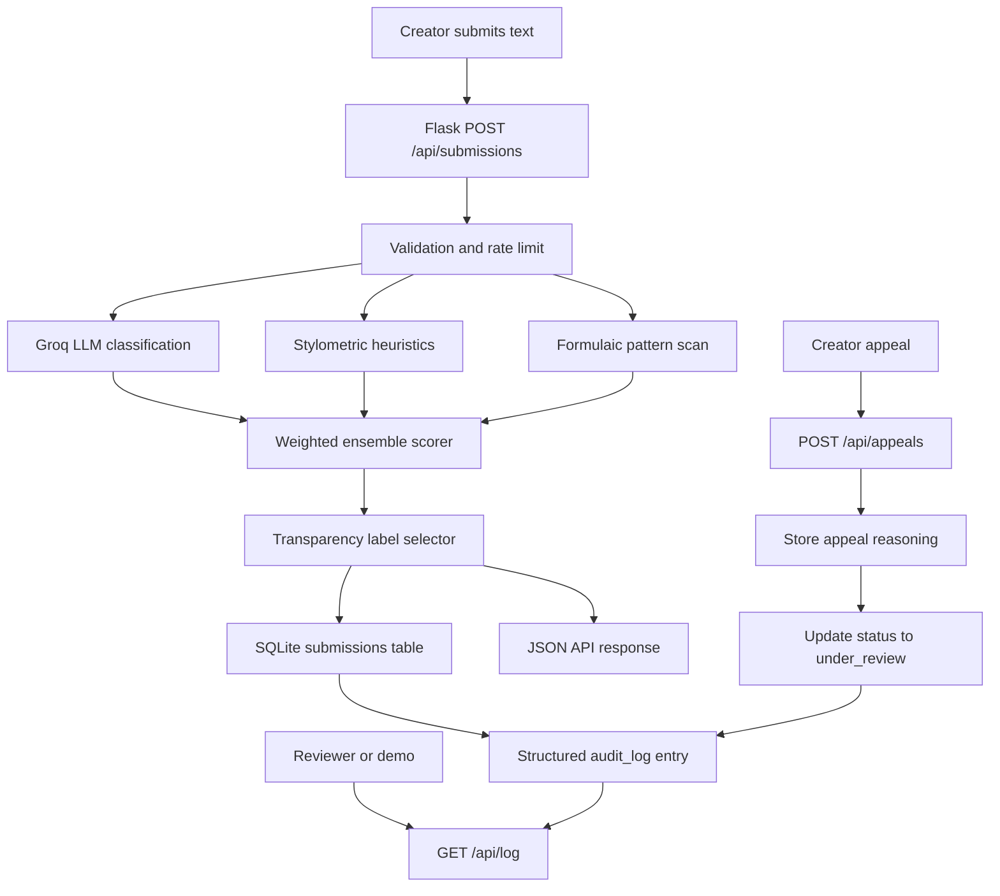

# Provenance Guard Planning

## Milestone 1 Checklist

- Required features read and translated into one end-to-end system path.
- Detection signals chosen before implementation: Groq LLM classification, stylometric heuristics, and a formulaic pattern scan.
- Confidence score ranges and uncertainty thresholds defined before coding.
- Transparency label text drafted for high-confidence AI, uncertain, and high-confidence human results.
- Appeals workflow planned, including creator reasoning, status update, and audit-log behavior.
- Edge cases identified before implementation.
- Architecture diagram included under `## Architecture`.
- AI Tool Plan included with the specific implementation work delegated to AI assistance and how it will be checked.

## Problem Summary

Creative sharing platforms need a way to give readers context about whether a post appears human-written, AI-generated, or uncertain without turning an imperfect detector into a final judgment. Provenance Guard accepts submitted writing, runs multiple independent review signals, combines those signals into a confidence-aware result, returns a plain-language transparency label, and gives creators a path to appeal.

The core design principle is caution. A false positive that labels a human creator's work as AI-generated can damage trust and discourage the creator from posting again. Because of that, the system should only use a high-confidence AI label when multiple signals point in the same direction. Borderline results should be labeled as uncertain and paired with an appeal path.

## Architecture

## Architecture Narrative

A single piece of text starts as a creator submission to the platform. The API receives the text, validates that it has enough content to evaluate, and checks the rate limit before spending model or storage resources. Then the text is sent through independent detection components. The Groq LLM signal gives a semantic review, the stylometric signal measures statistical writing structure, and the formulaic pattern signal looks for template-like repetition.

Those signal results move into the ensemble scorer, which combines them into an `ai_probability` and `confidence_score`. The label selector turns those numbers into the reader-facing output: likely AI, likely human, or uncertain. The API stores the result in SQLite with a content hash, content preview, timestamp, signal details, confidence, and final label text. At the same time, it writes a structured audit-log event so reviewers can inspect what happened later. Finally, the API returns a JSON response that includes the attribution result, confidence score, transparency label, and individual signal scores.

If a creator disagrees with the decision, they submit an appeal against the `submission_id`. The appeals endpoint records the creator's reasoning, changes the content status to `under_review`, and writes an appeal event to the same audit log so the appeal is visible beside the original classification.

## Component Responsibilities

| Component | Responsibility |
| --- | --- |
| Flask API | Owns request validation, HTTP responses, and route boundaries. |
| Flask-Limiter | Protects the content submission endpoint from floods and repeated probing. |
| Detection pipeline | Runs independent signals and returns normalized `0.0` to `1.0` scores. |
| Ensemble scorer | Combines signal scores, calculates confidence, and keeps uncertain cases uncertain. |
| Label selector | Maps scores to exact reader-facing label text. |
| SQLite audit store | Persists submissions, appeals, and structured audit-log events. |
| `GET /api/log` | Makes grader/reviewer evidence visible in structured JSON. |

## Submission Flow

1. A creator sends text and an optional `creator_id` to `POST /api/submissions`.
2. Flask validates that the content is long enough to score and Flask-Limiter checks the per-IP limit.
3. The detection pipeline runs three signals:
   - Groq LLM classification for semantic judgment.
   - Stylometric heuristics for measurable writing structure.
   - Formulaic pattern scan for repeated template-like phrasing.
4. The ensemble scorer computes a weighted `ai_probability`, signal agreement, and final `confidence_score`.
5. The label selector maps the score into one of three reader-facing label variants.
6. SQLite stores the decision with a content hash, content preview, status, scores, signal details, and timestamps.
7. A structured `classification_decision` audit entry is written.
8. The API returns JSON with the attribution result, confidence score, transparency label, and per-signal details.

## Appeal Flow

1. A creator sends `submission_id`, `creator_id`, and `reason` to `POST /api/appeals`.
2. The app verifies that the original submission exists.
3. The appeal is stored with the creator's reasoning.
4. The submission status changes from `classified` to `under_review`.
5. A structured `appeal_submitted` audit entry records the appeal and original decision.

## Detection Signals

| Signal | Property measured | Why it helps | Limitation |
| --- | --- | --- | --- |
| Groq LLM classification | Semantic and stylistic plausibility judged by `llama-3.3-70b-versatile`. | It can detect holistic patterns that simple statistics miss. | It can be overconfident and depends on API availability. |
| Stylometric heuristics | Sentence-length variance, vocabulary diversity, average sentence length, punctuation density. | AI-generated prose often has smoother structure and less irregularity than human drafts. | Genre and author style can produce similar statistics. |
| Formulaic pattern scan | Template phrases, repeated bigrams, repeated sentence openings. | Generated text can lean on repeated transitions or generic framing. | Formal human essays can trigger the same markers. |

### Why These Signals Are Distinct

The Groq signal is semantic: it asks a model to judge the whole text as writing. Stylometric heuristics are structural: they measure the distribution and variability of the text without interpreting its meaning. The formulaic pattern scan is phrase-pattern based: it looks for repeated or generic wording that can appear in generated prose. These are distinct because they inspect different properties of the submission rather than running three versions of the same classifier.

The minimum required pair is Groq plus stylometry. I added the formulaic scan as a third small signal because repeated template phrasing is not the same as general sentence-length variance or vocabulary diversity. It also gives local development a useful extra signal if Groq is unavailable.

## Scoring and Thresholds

When Groq is available, weights are:

- Groq LLM classification: 55%
- Stylometric heuristics: 30%
- Formulaic pattern scan: 15%

When Groq is unavailable, the available local signals are reweighted so the app still returns a useful development result. The final demo should use Groq so the recommended signal is active.

Thresholds:

| Range | Label |
| --- | --- |
| `ai_probability >= 0.72` and `confidence_score >= 0.70` | High-confidence AI |
| `ai_probability <= 0.28` and `confidence_score >= 0.70` | High-confidence human |
| Everything else | Uncertain |

`0.50` means the system does not have a strong direction. Scores near `0.51` should produce the uncertain label because the evidence is too weak to be useful to readers. Scores near `0.95` should produce a high-confidence label only when signals strongly agree.

### Uncertainty Policy

Uncertainty is a first-class result, not an error state. If the system lands near the middle or the signals disagree, the reader should see the uncertain label instead of a forced AI/human verdict. This is especially important because creative writing can be intentionally polished, repetitive, minimal, or experimental.

The confidence score should communicate strength of evidence, not moral certainty. A high confidence score means the available signals agree strongly enough to show a clearer label. A low or medium confidence score means the system should avoid overclaiming and invite more context through the appeal process.

## Transparency Labels

| Variant | Exact text |
| --- | --- |
| High-confidence AI | "Provenance Guard: This piece appears likely to be AI-generated. Multiple review signals point in that direction with high confidence. The creator can appeal this label." |
| High-confidence human | "Provenance Guard: This piece appears likely to be human-written. The review found limited AI-generation signals, but this is not a guarantee." |
| Uncertain | "Provenance Guard: We cannot confidently determine how this piece was created. Readers should treat the attribution as uncertain, and the creator can provide more context." |

### Label Design Notes

The labels avoid technical terms like classifier, logits, ensemble, or probability. They say what the reader needs to know, include appropriate caution, and make the appeal path visible when the result could harm the creator. The high-confidence human label still avoids saying "verified human" because this system does not prove authorship; it only reports limited AI-generation signals.

## Rate Limit Plan

Limit: `12 per minute; 100 per day` per remote address.

This supports a creator testing multiple drafts in a short session while making it expensive for an adversary to flood the endpoint or probe the detector repeatedly. A production version would likely add account-level limits in addition to IP limits.

## Audit Log Plan

SQLite tables:

- `submissions`: one row per classified content submission.
- `appeals`: one row per creator appeal.
- `audit_log`: structured event stream containing both classification and appeal events.

Every classification entry includes:

- submission id
- timestamp
- content hash and preview
- attribution result
- AI probability
- confidence score
- label text
- signal names, scores, confidence values, rationales, and details

Every appeal entry includes:

- appeal id
- submission id
- timestamp
- creator id
- creator reasoning
- updated status
- original decision summary

## Validation Plan

To verify that scores are meaningful, I will test at least three types of input:

1. A polished, generic, formulaic sample that should push the system toward a higher AI probability.
2. A specific, sensory, uneven personal narrative sample that should push the system toward a lower AI probability.
3. A mixed or ambiguous creative sample that should produce an uncertain result.

The expected behavior is not perfect detection. The expected behavior is separation between high-confidence and lower-confidence cases, visible signal-level evidence, and conservative labeling for borderline examples.

## Anticipated Edge Cases

| Edge case | Handling |
| --- | --- |
| Very short text | Reject with `400 content_too_short` because the signals need enough evidence. |
| Groq key missing or API unavailable | Mark the Groq signal unavailable and continue with local signals for development. |
| Polished human essay | Conservative thresholds should keep borderline cases in `uncertain` instead of labeling as AI. |
| Repetitive experimental poem | May look formulaic; creator can appeal and provide drafting context. |
| Unknown submission id for appeal | Return `404 submission_not_found`. |
| Creator appeals with vague reasoning | Return a validation error and ask for a more specific explanation. |
| Same content submitted repeatedly | Store each decision separately with a content hash so reviewers can compare repeated decisions. |
| Signals strongly disagree | Route to the uncertain label because disagreement means the system should not overclaim. |

## AI Tool Plan

I plan to use AI tools during implementation for these specific tasks:

1. Generate the Flask route and storage scaffolding from the required feature list, the architecture diagram, and the submission/appeal flows above.
2. Draft detector helper functions from the Detection Signals section, while I review whether each signal really measures a different property of the text.
3. Draft tests that map directly to the grading rubric: structured submission response, per-signal scores, appeal status update, and audit-log visibility.
4. Draft README evidence from the Transparency Labels, Rate Limit Plan, Audit Log Plan, and Validation Plan sections.

I will verify generated code by running the unit tests, running the demo seed script, checking real API responses, and confirming that README evidence covers the rubric items. I will also manually review the labels to make sure they sound fair to a non-technical reader and do not imply certainty the system does not have.
